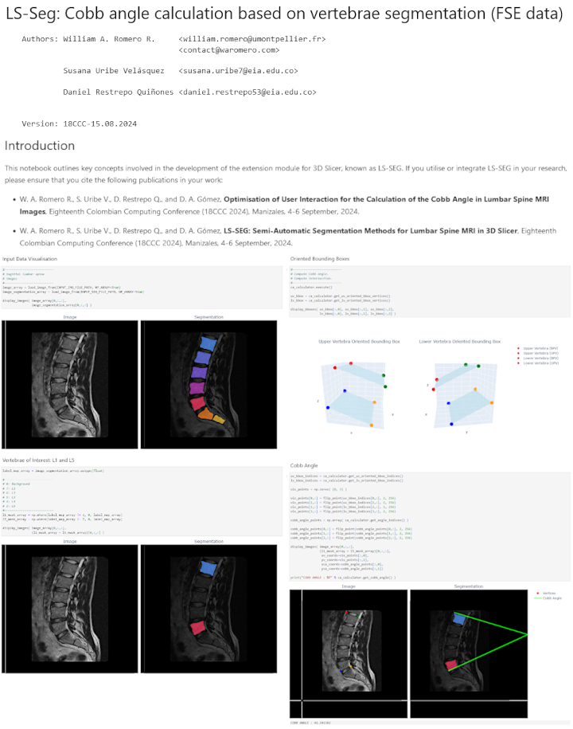

# LS-Seg 

LS-Seg is a 3D Slicer Extension developed to ease lumbar spine segmentation on MR images. If you utilise or integrate LS-SEG in your research, please ensure that you cite the following publications in your work:

- W. A. Romero R., S. Uribe V., D. Restrepo Q., and D. A. Gómez, **Optimisation of User Interaction for the Calculation of the Cobb Angle in Lumbar Spine MRI Images**, Eighteenth Colombian Computing Conference (18CCC 2024), Manizales, 4-6 September, 2024.

- W. A. Romero R., S. Uribe V., D. Restrepo Q., and D. A. Gómez, **LS-SEG: Semi-Automatic Segmentation Methods for Lumbar Spine MRI in 3D Slicer**, Eighteenth Colombian Computing Conference (18CCC 2024), Manizales, 4-6 September, 2024.

## Introductory Jupyter Notebooks for Getting Started with the `lsseg` Module

These instructional Jupyter Notebooks provide a comprehensive guide to help users get started with the `lsseg` module. They cover fundamental concepts, setup instructions, and practical examples to facilitate understanding and usage.

")

## Main developers

* [Daniel Restrepo Quiñones](https://github.com/Cecilio0) (Universidad EIA).
* [Susana Uribe Velásquez](https://github.com/Susiur) (Universidad EIA).
* [William A. Romero R.](https://github.com/waromero) (CARTIGEN - Université de Montpellier / CHU Montpellier).
